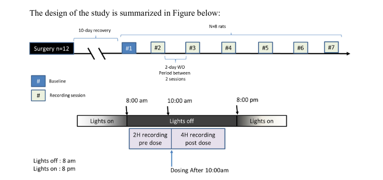
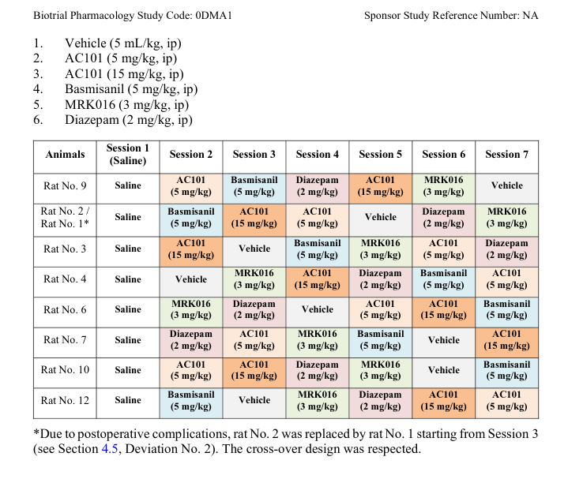
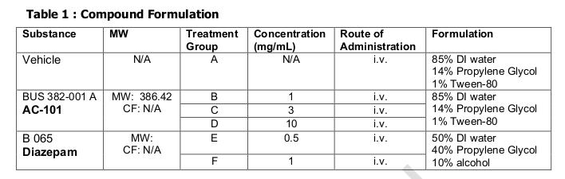

# Damona

## Biotrial
Study design:





## CRL
Study design:




This repository provides a comprehensive data processing pipeline to convert raw EEG and other physiological data from MATLAB format to MNE Python compatible format.
Prerequisites

    Python 3.8+
    mne library for electrophysiological data processing
    numpy and scipy libraries for numerical operations
    scipy.io for MATLAB file loading


## load_data_01_biotrial.py

This script processes raw electrophysiology data in MATLAB format (.mat files) from rat studies, using libraries such as os, mne, numpy, scipy, pandas, and pathlib. It uses parallel processing to accelerate the computation when handling multiple files. Here's how it works:

    Initialization: It begins by setting up the necessary Python libraries for processing and storing the electrophysiology data.

    Mapping Sessions to IDs: A function (map_sessions_to_id) reads in a CSV file that provides a mapping between the session data and encoded IDs. It transforms this CSV into a dictionary structure for efficient lookups.

    Data Processor: The DataProcessor class is initialized with the .mat file, a directory to save the processed data, and the dictionary mapping sessions to IDs. Its primary function, process, handles the loading and processing of the .mat files. It extracts relevant metadata (such as treatment data, rat ID, session ID), processes different signal types, resamples them if necessary, and splits the data into baseline and manipulation periods based on the dosing offset. The processed data is then saved into .fif files (a format used by MNE-python for raw data).

    Upsampling Data: For signal data that is at a lower sampling rate than desired, the repeat_upsample function is used to increase its frequency by repeating elements.

    Processing All Data: The process_rat_data function is used to process all the .mat files in a given folder using parallel computation. It prepares the necessary arguments and uses a multiprocessing pool to process the files in parallel, which greatly speeds up the processing time if many files need to be processed.

    Error Handling: The process_mat_file function wraps around the creation of a DataProcessor object and the call to its process method, catching any errors related to empty or corrupted .mat files and printing a corresponding error message.

    Command-Line Interface: The main function serves as the entry point when the script is run from the command line. It takes an optional argument --n_jobs that specifies the number of parallel jobs to run for data processing. This number can be adjusted depending on the computational resources available on the machine running the script. The function handles the mapping of session IDs, sets up the necessary folder paths, and processes all rat data folders.


## load_data_01_crl.py
This script processes European Data Format (EDF) files and extracts relevant physiological data. This is particularly used for processing rat EEG data, which is stored in EDF format.

The script performs the following operations:

    Session Mapping: It reads a CSV file that maps each rat's session number to an encoded session ID. This CSV file should be formatted with pairs of columns representing the rat's number and the session ID, respectively.

    EDF File Processing: The script scans a specified input folder and its subfolders for EDF files. Each EDF file is processed independently, with the extraction of relevant data and metadata from the file.

    Data Resampling: The data is resampled to a target sampling frequency of 125 Hz if the original sampling frequency is higher.

    Metadata Extraction: It identifies each rat and their treatment condition from the file name and folder structure.

    Data Saving: The processed data, along with the extracted metadata, is saved in a Python-friendly MNE Raw format to a specified output folder, organized by rat number and condition ID.

You can run the script with command line arguments to specify the input EDF file directory, output directory, and the CSV file path for session ID mapping.

This script requires the MNE library to process EDF files and Pandas to handle CSV files and data organization.


## File structure
This dataset contains electrophysiological recordings of rat brain activity, organized by experimental conditions and individual rats. The recordings are in the MNE-Python compatible FIF format. Each individual rat's recordings are represented by two separate files: a "baseline" file and a "manipulation" file. The baseline file contains the normal state of the rat's brain activity, while the manipulation file contains the brain activity after some experimental manipulation.
Raw data is organized as it is (e.g. for crl_data; analog for biotrial data):
```
crl_data
│
└───raw
```
Data after loading and restructuring:
```
crl_data/
│
└───mne_raw/
│
├───condition-1/
│ ├───rat_2_baseline.fif
│ ├───rat_2_manipulation.fif
│ ├───rat_4_baseline.fif
│ ├───rat_4_manipulation.fif
│ ├───...
│
└───condition-2/
├───rat_2_baseline.fif
├───rat_2_manipulation.fif
├───rat_3_baseline.fif
├───rat_3_manipulation.fif
├───...
```